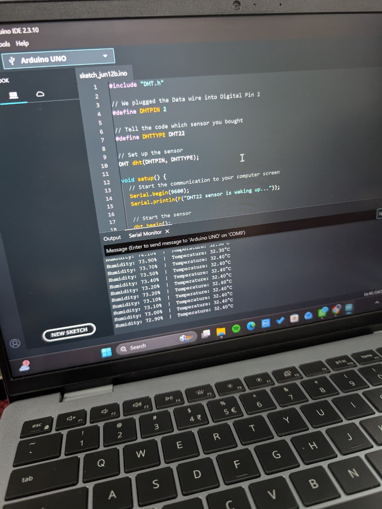
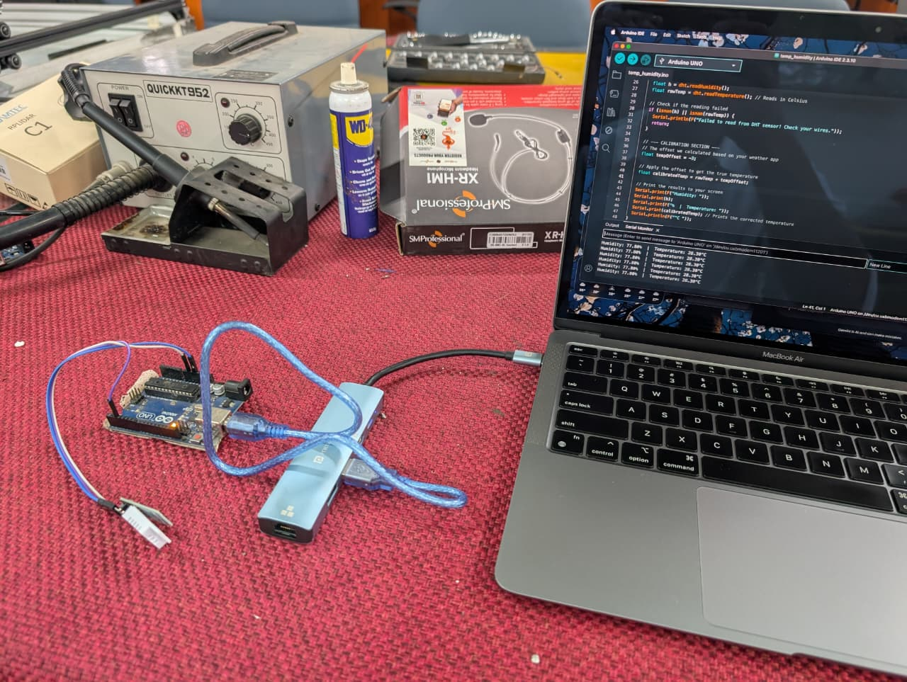

# Internship Weekly Log: Week 2

**Developer:** Anurag Debnath  
**Date:** June 12, 2026

---

## Day 1: June 12, 2026

### Focus Area: Embedded Systems — DHT22 Sensor Integration with Arduino Uno  
**Hardware:** Arduino Uno, DHT22 Temperature & Humidity Sensor  
**Environment:** Arduino IDE / macOS  

#### ✅ What I Did
1. **Hardware Setup & Wiring:**
   - Connected the DHT22 sensor to the Arduino Uno.
   - Identified and wired the necessary pins: VCC to 5V, GND to GND, and DATA to Digital Pin 2.
   - Learned the importance of using a 10kΩ pull-up resistor between VCC and DATA for bare 4-pin sensors to ensure stable data transmission.
2. **Software Configuration:**
   - Installed the Arduino IDE and configured it for the Arduino Uno board and the corresponding macOS serial port.
   - Installed the required `DHT sensor library` by Adafruit via the Library Manager, along with its dependencies (Adafruit Unified Sensor Library).
3. **Code Implementation:**
   - Authored and uploaded C++ code to initialize the DHT22 sensor and read data.
   - Set up serial communication at a 9600 baud rate to monitor the output.
   - Implemented a 2-second delay in the loop to accommodate the DHT22's data processing time.
   - Added error handling (`isnan()`) to verify data integrity before printing.
4. **Sensor Calibration:**
   - Conducted software-based calibration to correct sensor drift.
   - Established a "True Baseline" using a trusted household thermometer for temperature and the "Salt Test" (75% humidity in a sealed environment) for humidity.
   - Calculated the offset (True Value - Sensor Reading = Offset) and applied it within the Arduino code (e.g., `tempOffset = -0.5`, `humidOffset = +2.0`) to yield calibrated results.

#### 📸 Visual Evidence
*(Note: Placed screenshots in the `assets` folder of the repository)*

**1. Serial Monitor Output (Calibrated Data):**

**2. Hardware Wiring Setup:**

#### 🧠 Key Learnings
- **Pin Identification:** Successfully navigated the small labeling on the Arduino board to correctly map the 5V, GND, and Digital pins.
- **Code Structure:** Understood the fundamental architecture of an Arduino sketch:
    - **Global Variables ("Script Tags"):** Linking libraries and defining constants.
    - **`setup()` ("Window.OnLoad"):** One-time initialization of serial communication and sensors.
    - **`loop()` ("SetInterval"):** The continuous cycle of fetching, checking, and printing data.
- **Software Calibration:** Learned that hardware cannot be physically recalibrated; instead, systematic errors are corrected mathematically via software offsets in the code.

#### ❌ Issues Faced & Solutions
| Issue | Cause | Solution |
|-------|-------|----------|
| **"Failed to read from DHT sensor!" Error** | Loose wiring, missing pull-up resistor, or incorrect pin definition | Verified wiring to Digital Pin 2, confirmed 5V power, and ensured the 10kΩ resistor was in place. Double-checked `DHTTYPE` definition in code. |
| **Incorrect Readings (Drift)** | Factory calibration inaccuracies over time | Calculated the difference against a true baseline and added an offset variable to the code logic to mathematically correct the output. |

#### 📁 Assets
- temp_humidity.ino (`.ino` format) containing sensor initialization, read loop, error handling, and calibration logic.
