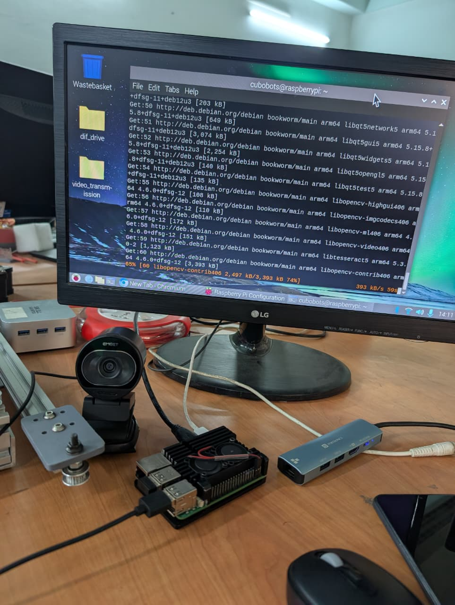
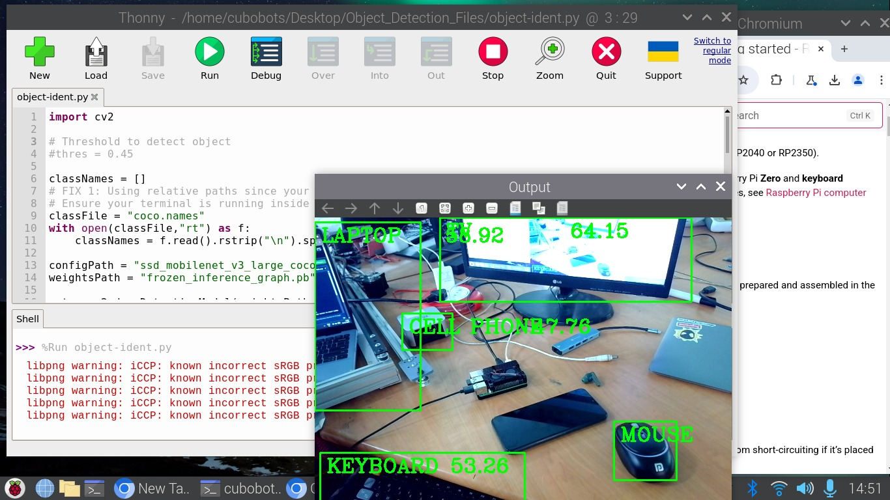

# Internship Weekly Log: Week 4

**Developer:** Anurag Debnath & Abhilash Ghosh \
**Date:** June 24, 2026  

---

## Day 1: June 24, 2026

### Part 1: Intelligent Robotics — EMEET SmartCam S600 Integration & Object Detection  
**Hardware:** Raspberry Pi (Arm64), EMEET SmartCam S600 (4K UVC)  
**Environment:** Raspberry Pi OS (Debian Bookworm)

#### ✅ What I Did
1. **Hardware Connection:** Plugged the 4K EMEET SmartCam into the Raspberry Pi.
2. **Environment Setup:** Installed OpenCV (`python3-opencv`) via `apt` in the local `cubobots` environment.
3. **Camera Verification:** Verified the camera feed using a basic OpenCV capture script, initially testing the `/dev/video0` node and fixing index assignments.
4. **Model Integration:** Downloaded the pre-trained object detection zip file ("Object and Animal Recognition With Raspberry Pi and OpenCV") from Core Electronics.
5. **Code Modification:** Refactored the core object detection script (`object-ident.py`). Replaced the hardcoded legacy paths (`/home/pi/...`) with relative file paths so it could run under the current `cubobots` user profile.
6. **Deployment:** Successfully executed the script to perform live, real-time object detection using the SSD MobileNet model.

#### 📸 Visual Evidence
<table>
  <tr>
    <td align="center"><b>1. Hardware Setup</b></td>
    <td align="center"><b>2. Live Object Detection Output</b></td>
  </tr>
  <tr>
    <td align="center"> </td>
    <td align="center"></td>
  </tr>
</table>

#### 📊 Results
| Metric | Value |
|--------|-------|
| **Camera Feed** | Downscaled to 640x480 for real-time processing |
| **Object Model** | SSD MobileNet v3 Large (COCO 2020) |
| **Detection Status** | Successfully identifying objects and applying bounding boxes |
| **Pathing Status** | Refactored for universal portability via relative paths |

#### 🧠 Key Learnings
- **User Environment Dependency:** Scripts downloaded from third-party tutorials often hardcode specific usernames (like the default `pi` user). Using relative file paths is a much more robust coding practice that ensures the script won't break when moved to a different machine or user profile (like `cubobots`).
- **OpenCV Video Nodes:** A single plugged-in USB camera can generate dozens of virtual `/dev/video` nodes on Raspberry Pi OS. Verifying the correct node index is a crucial first step before deploying a computer vision model.

#### ❌ Issues Faced & Solutions
| Issue | Cause | Solution |
|-------|-------|----------|
| `FileNotFoundError` for `coco.names` | Code hardcoded to the default `pi` username, but current user is `cubobots` | Refactored script to use relative file paths |
| `Internal data stream error` | OpenCV defaulted to unstable GStreamer backend | Initialized capture with `cv2.VideoCapture(0, cv2.CAP_V4L2)` |

#### 📁 Files Created / Modified
- [final_object-ident.py](../Raspberry/Object%20Detection/final_object-ident.py) — Fully refactored MobileNet SSD object detection script with relative pathing and live camera capture.

---
