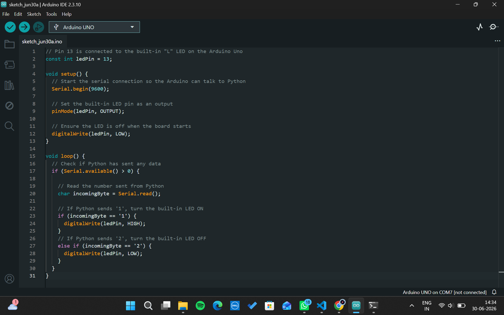
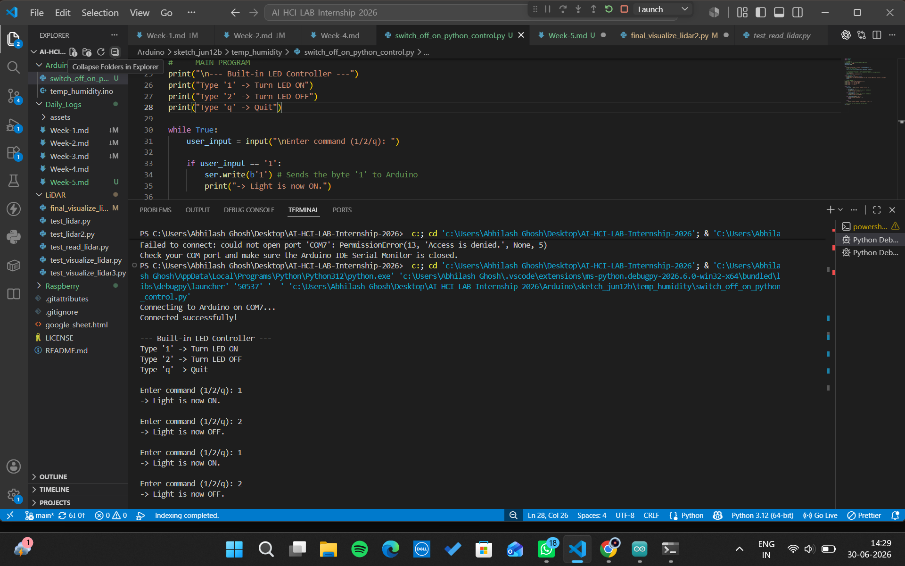
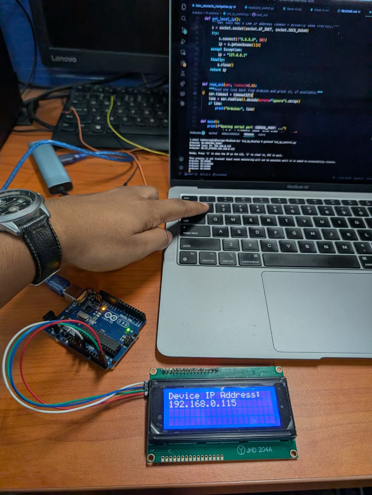
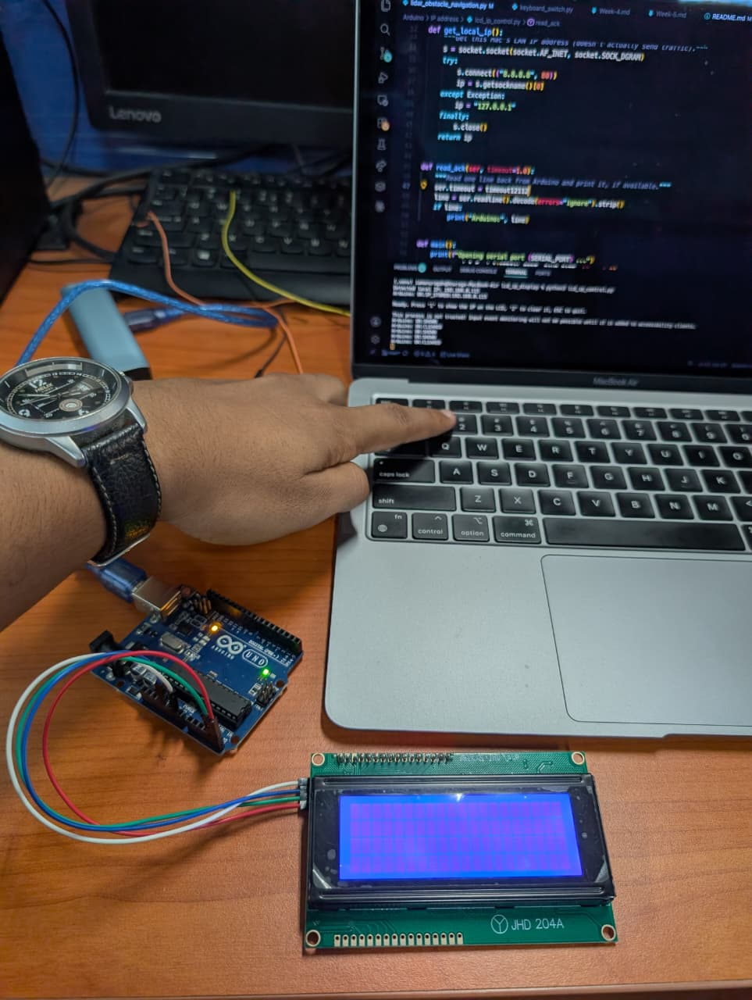

# Internship Weekly Log: Week 5

**Developer:** Abhilash Ghosh and Anurag Debnath\
**Date:** June 30, 2026 - July 1, 2026  

---

## Day 1: June 30, 2026

### Hardware-Software Interfacing — Arduino LED Control via Python Serial  
**Hardware:** Arduino Uno, USB A-to-B Cable  
**Environment:** Windows PC, Arduino IDE 2.3.10, VS Code, Python 3.12

#### ✅ What I Did
1. **Hardware Connection:** Connected the Arduino Uno to the PC via USB and identified the correct communication port (COM7).
2. **Microcontroller Setup:** Wrote and uploaded C++ code to the Arduino to initialize a 9600 baud serial connection and set the built-in LED (Pin 13) as an output.
3. **Environment Configuration:** Resolved a Python environment mismatch in VS Code by forcing the installation of the `pyserial` library directly into the specific Python 3.12 executable path used by the debugger.
4. **Code Development:** Wrote a Python script to establish a serial connection with the Arduino over COM7. 
5. **Command Integration:** Implemented a continuous `while True` loop in Python to capture keyboard input and transmit corresponding byte commands (`b'1'` for ON, `b'2'` for OFF) to the Arduino.
6. **Deployment:** Successfully achieved real-time hardware actuation (toggling the built-in LED) directly from the Python terminal interface.

#### 📸 Visual Evidence
<table>
  <tr>
    <td align="center"><b>1. Port Configuration</b></td>
    <td align="center"><b>2. Python Terminal Output</b></td>
  </tr>
  <tr>
    <td align="center"> </td>
    <td align="center"></td>
  </tr>
</table>

#### 📊 Results
| Metric | Value |
|--------|-------|
| **Target Hardware** | Arduino Uno (Built-in LED, Pin 13) |
| **Communication Protocol** | USB Serial |
| **Baud Rate** | 9600 bps |
| **Port Assignment** | COM7 |
| **Operation Status** | Successful real-time control via keyboard inputs |

#### 🧠 Key Learnings
- **Serial Port Exclusivity:** A single COM port can only be accessed by one application at a time. The Arduino IDE's Serial Monitor must be fully closed before a Python script can successfully connect to the microcontroller.
- **Hardware Reset Timing:** Opening a serial connection from Python automatically triggers a reset on the Arduino Uno. It is necessary to implement a delay (`time.sleep(2)`) in the Python script immediately after opening the port to allow the board to wake up before sending data.
- **Data Encoding:** Serial ports process raw bytes, not standard high-level strings. Commands sent via Python must be encoded as bytes (e.g., `b'1'`) for the Arduino to correctly read and process the incoming serial data.
- **Environment Management:** When working with VS Code debuggers, standard `pip install` commands might apply to a different global environment. Packages must be installed explicitly into the specific interpreter path executing the script.

#### ❌ Issues Faced & Solutions
| Issue | Cause | Solution |
|-------|-------|----------|
| `ModuleNotFoundError: No module named 'serial'` | The VS Code debugger was using a specific Python 3.12 executable that lacked the `pyserial` package. | Forced installation to the exact executable path: `& "...\python.exe" -m pip install pyserial` |
| `FileNotFoundError` for `COM3` | The Python script hardcoded `COM3`, but Windows assigned the Arduino to `COM7`. | Identified the correct port via Arduino IDE and updated the Python script variable to `arduino_port = 'COM7'` |

#### 📁 Files Created / Modified
- [serial_led_control.ino](../Arduino/led_control_python_serial/serial_led_control.ino) —  Arduino C++ script for initializing serial communication and listening for byte commands to toggle Pin 13.
- [switch_off_on_python_control.py](../Arduino/led_control_python_serial/switch_off_on_python_control.py) — Python controller script utilizing `pyserial` for user input routing and hardware communication.

---
## Day 2: July 1, 2026

### Embedded Systems — Arduino Uno + I2C LCD Device IP Display

**Hardware:** Arduino Uno, JHD629-204A 20x4 LCD, HW-61 I2C backpack (PCF8574, `0x27`), MacBook Air
**Environment:** macOS Tahoe, Arduino IDE 2.3.10, VS Code, Python 3.14 `.venv`, `pyserial` · `pynput`

#### ✅ What I Did
0. **Original Plan — ESP32 + Python Serial (Abandoned):** Initially chose an ESP32 Dev Module for its built-in WiFi. Dropped it for two reasons:
   - **Voltage mismatch:** ESP32's 3.3V logic couldn't reliably drive the 5V JHD629-204A/HW-61 I2C bus — backpack showed signs of heat buildup from the mismatch.
   - **Driver incompatibility:** ESP32's CP2102 USB-serial chip has no working driver on macOS 26 Tahoe (`kextstat | grep silabs` confirmed the kext wasn't loading, no `/dev/cu.SLAB_USBtoUART` port ever appeared).
   - Switched to an Arduino Uno — natively 5V, and uses an ATmega16U2 chip macOS supports without any driver.

1. **Design Decision — Skip ESP8266, Use Host-Relayed IP:** Rather than adding an ESP8266 ESP-01 just so the Arduino could fetch its own IP, simplified the design: the MacBook already knows its own IP, so Python reads it and relays it to the Arduino over the existing USB serial link. No WiFi hardware or credentials needed on the Arduino at all.

2. **Wiring (I2C, 4-wire):**
   - `SDA → A4`
   - `SCL → A5`
   - `VCC → 5V`
   - `GND → GND`

3. **Arduino Sketch (`lcd_ip_display.ino`):** Built with the `LiquidCrystal_I2C` library over `Wire.h`. The Arduino stays a "dumb" display, driven entirely by serial commands from the Mac:
   - `IP:<address>` → store the IP
   - `SHOW` → display the stored IP
   - `CLEAR` → clear the LCD
   - Each command gets an acknowledgement sent back over serial.

4. **Python Control Script (`lcd_ip_control.py`):** Uses `pynput.keyboard.Listener` for a global keypress listener (no need to focus the terminal or press Enter).
   - On startup, fetches the Mac's LAN IP and sends it once
   - **1** → show IP on LCD
   - **2** → clear LCD
   - **Esc** → exit

5. **Debugging & Fixes:**
   - **Arduino not detected:** Traced to a charge-only USB cable — fixed by switching to a real data cable.
   - **`pip install` failed** with "externally-managed-environment" — fixed by activating the project's `.venv` before installing.
   - **Python script "file not found"** — fixed by running it from the correct subfolder after the files were moved.
   - **Re-checked the CP2102 driver concern** from the ESP32 attempt — confirmed it's a non-issue now, since the Uno uses ATmega16U2/CH340 instead.

6. **Verified End-to-End:** Uploaded the sketch, ran the Python script, pressed **1**, and confirmed the LCD displayed `Device IP Address: 192.168.0.115` (the Mac's actual LAN IP). Pressed **2** and confirmed the LCD cleared.

#### 🧩 How the IP Address Actually Gets to the LCD
- The MacBook is on the local WiFi network, which assigns it a private LAN IP via DHCP (e.g. `192.168.0.115`).
- Python discovers that IP using a lightweight, traffic-free trick: open a UDP socket, "connect" it to `8.8.8.8:80` (no data actually sent), then read back which local IP the OS *would* use via `getsockname()`.
- That IP is sent to the Arduino as `IP:<address>` over the same **USB serial cable** used to program it — the Uno's onboard USB-serial chip converts it to UART data on the ATmega328P's RX pin.
- The Arduino stores the IP string but doesn't display it yet.
- Pressing **1** sends `SHOW` → the Arduino writes the IP to the LCD over I2C, via `Wire.h` → PCF8574 (HW-61 backpack) → LCD.
- Pressing **2** sends `CLEAR` → the Arduino calls `lcd.clear()`.

**In short:** the Arduino never touches WiFi or the network — it's a serial-controlled display only. All networking happens on the Mac.

#### 📸 Visual Evidence
<table>
  <tr>
    <td align="center"><b>1. Pressing '1' — IP Address Displayed</b></td>
    <td align="center"><b>2. Pressing '2' — LCD Cleared</b></td>
  </tr>
  <tr>
    <td align="center"></td>
    <td align="center"></td>
  </tr>
</table>

#### 📊 Results
| Metric | Value |
|--------|-------|
| **LCD Model** | JHD629-204A (20x4 character LCD) |
| **I2C Backpack** | HW-61 (PCF8574 chip) |
| **I2C Address** | `0x27` |
| **Wiring** | 4-wire (SDA → A4, SCL → A5, VCC → 5V, GND → GND) |
| **Baud Rate** | 9600 |
| **Serial Protocol** | `IP:<addr>` / `SHOW` / `CLEAR` (newline-terminated) |
| **Keypress Latency (key → LCD update)** | < 200ms |
| **IP Discovery Method** | UDP socket trick (no packets actually sent) |
| **Network Hardware on Arduino** | None — Arduino is serial-only, all networking on host Mac |

#### 🧠 Key Learnings
- **Match voltages between MCU and peripherals:** A 3.3V microcontroller driving a 5V I2C bus is unreliable — logic HIGH (3.3V) can fall below the peripheral's input threshold, causing missed signals, display corruption, or heat buildup. Match voltages or use a level shifter.
- **USB-serial chip identity matters more than the cable/USB standard:** Board detection on macOS depends on the specific USB-to-serial chip, not the cable type:
  - **ATmega16U2** — native macOS support, no driver needed
  - **CH340/CH341** — needs the WCH VCP driver
  - **CP2102** — separate driver, known to break on macOS Tahoe beta
  - Check the chip before picking a board (System Report on Mac, `lsusb` on Linux, Device Manager on Windows) — saves debugging time later.
- **Simplify before adding hardware:** Adding an ESP8266 just so the Arduino could fetch its own IP would mean AT commands, a second serial channel, and stored WiFi credentials — for something the host computer already knows. When the controlling computer has the data, relaying it over an existing link beats duplicating that capability on the microcontroller.
- **`socket.connect()` on UDP doesn't send data:** "Connecting" a UDP socket without calling `send()` is a lightweight way to ask the OS which local IP it would use for a route — useful for LAN IP discovery with no actual network traffic.
- **A "USB cable" isn't always a data cable:** Charge-only cables are an easy-to-miss cause of a board not appearing in the Serial Port list at all — worth ruling out before chasing driver issues.
- **Activate the venv in every new terminal session:** Having a `.venv` folder isn't enough — each terminal needs `source .venv/bin/activate` run explicitly, or `pip`/`python3` silently falls back to system Python and its restrictions (e.g. Homebrew's PEP 668 protection).
- **Working directory matters as much as file paths:** Running a script from the wrong folder produces the same "file not found" error as a genuinely missing file — always confirm the terminal's location matches where the script lives.

#### ❌ Issues Faced & Solutions
| Issue | Cause | Solution |
|-------|-------|----------|
| ESP32 3.3V logic vs. LCD 5V mismatch, backpack running hot | ESP32 GPIO/I2C lines run at 3.3V; JHD629-204A + HW-61 backpack designed for 5V | Switched to Arduino Uno (5V), eliminating the voltage mismatch entirely |
| ESP32 not detected on macOS Tahoe — no `/dev/cu.SLAB_USBtoUART` port | macOS 26 dropped legacy kext support; CP2102 driver fails to load (`kextstat \| grep silabs` confirmed) | Switched to Arduino Uno (ATmega16U2) — native macOS USB support, no driver needed |
| `Arduino UNO [not connected]`, no serial port listed | Charge-only USB cable | Swapped to a proper USB-A-to-B data cable |
| Lingering concern the CP2102 driver issue would resurface | Carried over from the earlier ESP32/ESP8266 plan | Confirmed the Uno uses ATmega16U2, not CP2102 — non-issue once the WiFi-module approach was dropped |
| `pip3 install ...` → `error: externally-managed-environment` | Command run against system Python, not the project's `.venv` | Activated `.venv` first (`source .venv/bin/activate`) before installing |
| `python3 lcd_ip_control.py` → `[Errno 2] No such file or directory` | Script had been moved into `Arduino/IP address/`, but command was run from `Arduino/` | `cd "IP address"` before running the script |
| Unclear how the Arduino "gets" the IP with no WiFi hardware onboard | Original design assumed the Arduino needed its own network stack | Documented that the Mac discovers its own IP and relays it over the existing USB serial link — no networking happens on the Arduino |

#### 📁 Files Created / Modified
- [lcd_ip_display.ino](../Arduino/lcd_ip_display/lcd_ip_display.ino) — Arduino sketch that receives IP/SHOW/CLEAR commands over serial and drives the 20x4 I2C LCD accordingly.
- [lcd_ip_control.py](../Arduino/lcd_ip_display/lcd_ip_control.py) — Python script that discovers the Mac's LAN IP, listens for global `1`/`2` keypresses, and sends the corresponding serial commands to the Arduino.
